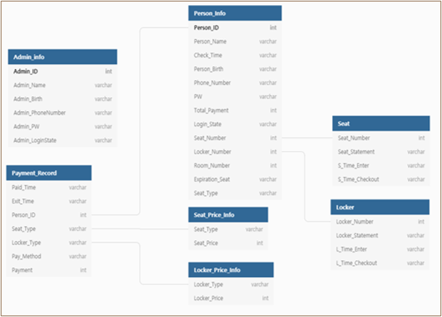

# 프로젝트 Study_Room
>JAVA SWING 기반 스터디룸 프로그램

# 프로젝트 명
>KG 무인 스터디 룸

# 프로젝트 기획 의도

 >KG스터디룸은 고객응대 최소화 맞춤형 시스템입니다. 이용권 판매, 대기고객 예약 및 안내, 사물함 및 좌석 안내 등 스터디 카페 운영 중 필수적인 부분들을 실시간으로 처리 할 수 있습니다. 또한 사장님께서 실시간으로 매장의 운영현황을 파악할 수 있습니다. 

# 실행방법
> studyroom 패키지 내의 MainPage.java 파일을 실행하면 로그인 페이지가 나옵니다. 
회원가입 및 로그인을 하면 DB 데이터와 연결되어 동시적으로 정보가 반영됩니다. 로그인을 하면 
왼쪽 상단에 현재 사용중인 좌석 및 사물함과 시간을 확인할 수 있고, 이용권 구매, 좌석 선택, 사물함 선택이 가능합니다.
* 이용권 구매를 하면 좌석,룸,사물함을 시간별로 구매할 수 있습니다. 일일 이용권과 정기 이용권이 있습니다.
* 왼쪽 상단에 홈을 누른 후 자리이동 및 퇴실이 가능하며 정기이용권 구매자는 퇴실 후 재입실이 가능합니다.
* 관리자 페이지는 로그아웃 진행 후 왼쪽 상단에 버튼을 누르면 관리자 로그인 페이지로 이동합니다.
* 관리자 페이지에는 매장관리, 회원관리, 매출관리, 이용권 가격 조정이 있습니다.
* 매장 관리에선 현재 스터디룸 상황과 자리 이동 및 퇴실시키는 기능이 있습니다.
* 회원 관리에선 현재 가입된 회원들의 정보 및 현황을 파악할 수 있습니다.
* 매출 관리에선 현재까지 매출을 연,월,일 별로 파악할 수 있습니다.
* 이용권 가격 조정기능에는 이용권 가격을 조정할 수 있습니다.

# 프로그램의 구성
* 관련 소스(코드) 프로젝트 폴더 내 코드는 'admin(관리자)','design(디자인)','swingTools(프레임)','user(사용자)','window(페이지 이동 액션)'로 분류된 패키지 내부에 각각 보관되어 있습니다.
* 관련 JAR 파일로는 'ojdbc8(DB 관련)'이 존재합니다.
* Oracle DB 해당 프로젝트의 데이터베이스는 'Oracle Database 11g express Version'으로 구현하였습니다. 사용된 테이블은 Admin_info, Persin_info, Payment_Record, Seat, Locker, Seat_price_info, Locker_price_info가 있습니다.
각 테이블의 항목은 다음으로 구성되어 있습니다.

# 프로그램 설계에 관련된 기술
>  해당 프로그램은 JAVA 프로그래밍 언어로 설계되어 있습니다. 또한 DB 구현을 위한 데이터베이스 언어(SQL)가 포함되어 있습니다. 화면 설계는 JAVA API 중 대표적으로 JFRAME, SWING 등이 적용되었으며 그밖에 다양한 API을 적용시켰습니다.

